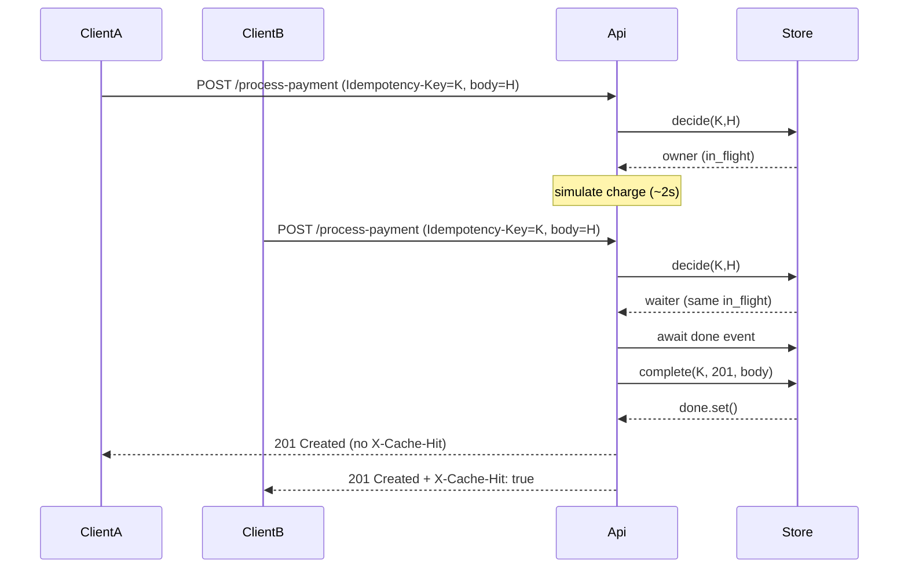

# Idempotency-Gateway

This repository is the **AmaliTech Idempotency-Gateway** submission.

REST API that implements a **pay-once** idempotency layer for payment-style `POST` requests. Clients send an `Idempotency-Key` header; retries with the same key and body receive the **exact same** HTTP status and JSON body without re-running processing.

## Live Demo (Render)

- **Base URL**: `https://amalitech-project-challenge.onrender.com`
- **Swagger UI**: `https://amalitech-project-challenge.onrender.com/docs`
- **ReDoc**: `https://amalitech-project-challenge.onrender.com/redoc`
- **OpenAPI JSON**: `https://amalitech-project-challenge.onrender.com/openapi.json`

### Quick test (first request)

```bash
curl -sS -X POST "https://amalitech-project-challenge.onrender.com/process-payment" \
  -H "Content-Type: application/json" \
  -H "Idempotency-Key: render-demo-1" \
  -d "{\"amount\":100,\"currency\":\"GHS\"}"
```

### Quick test (safe retry)

Repeat the same `curl`. The second call should return immediately and include `X-Cache-Hit: true`.

## Architecture

### Sequence (happy path, replay, and in-flight)



### Components

| Piece | Role |
|--------|------|
| `app/main.py` | FastAPI routes, dependency wiring, lifespan (starts background cleanup). |
| `app/idempotency_store.py` | In-memory per-key locking, in-flight waiting, mismatch checks, TTL + eviction. |
| `app/models.py` | Pydantic request/response schemas. |
| `app/config.py` | Environment-driven settings (TTL, cleanup interval, simulated delay). |

## Setup

**Requirements:** Python 3.11+ (3.10+ should work).

```bash
# From the repository root (after cloning)
python -m venv .venv
# Windows:
.venv\Scripts\activate
# macOS/Linux:
# source .venv/bin/activate

pip install -r requirements.txt
```

### Run the server

```bash
python -m uvicorn app.main:app --host 0.0.0.0 --port 8000
```

Health check: `GET http://localhost:8000/health`

Interactive docs: `http://localhost:8000/docs`

### Run tests

```bash
python -m pytest tests/ -v
```

## API

### `POST /process-payment`

**Requires** header `Idempotency-Key` (non-empty string).

**Request body (JSON)**

| Field | Type | Rules |
|--------|------|--------|
| `amount` | integer | ≥ 1 |
| `currency` | string | non-empty |

**First successful response**

- Status: **`201 Created`**
- Body: `{ "message": "Charged <amount> <currency>" }`
- Simulated processing delay: **2 seconds** by default (configurable via `PAYMENT_DELAY_SECONDS`).

**Duplicate (same key + same logical body)**

- Status and body: **identical** to the first successful response.
- Header: **`X-Cache-Hit: true`**
- No second processing delay.

**Same key, different body**

- Status: **`409 Conflict`**
- Body: `{ "detail": "Idempotency key already used for a different request body." }`

**Missing `Idempotency-Key`**

- Status: **`400 Bad Request`**

### Example: first charge

```bash
curl -sS -X POST "http://localhost:8000/process-payment" \
  -H "Content-Type: application/json" \
  -H "Idempotency-Key: shop-orders-42" \
  -d "{\"amount\":100,\"currency\":\"GHS\"}"
```

## Design decisions

1. **Canonical body fingerprint** — SHA-256 over canonical JSON (`sort_keys=True`) so different JSON key order still replays.
2. **Per-key locks + in-flight event** — concurrent identical requests wait for the first and then replay.
3. **409 on mismatch** — same key used for a different body is rejected (completed or in-flight).

## Developer’s choice: TTL + bounded memory

Real idempotency keys must expire to avoid unbounded memory growth.

- **`IDEMPOTENCY_TTL_SECONDS`** (default **1800**) controls replay window for completed records.
- **Cleanup loop** periodically removes expired entries (`CLEANUP_INTERVAL_SECONDS`, default **60**).
- **Soft cap** via `MAX_IDEMPOTENCY_RECORDS` (default **10000**) evicts oldest completed entries first.

## Configuration (environment)

| Variable | Default | Description |
|-----------|---------|-------------|
| `PAYMENT_DELAY_SECONDS` | `2` | Simulated charge latency. |
| `IDEMPOTENCY_TTL_SECONDS` | `1800` | How long completed responses are retained for replay. |
| `CLEANUP_INTERVAL_SECONDS` | `60` | How often expired entries are swept. |
| `MAX_IDEMPOTENCY_RECORDS` | `10000` | Soft upper bound on stored keys. |
