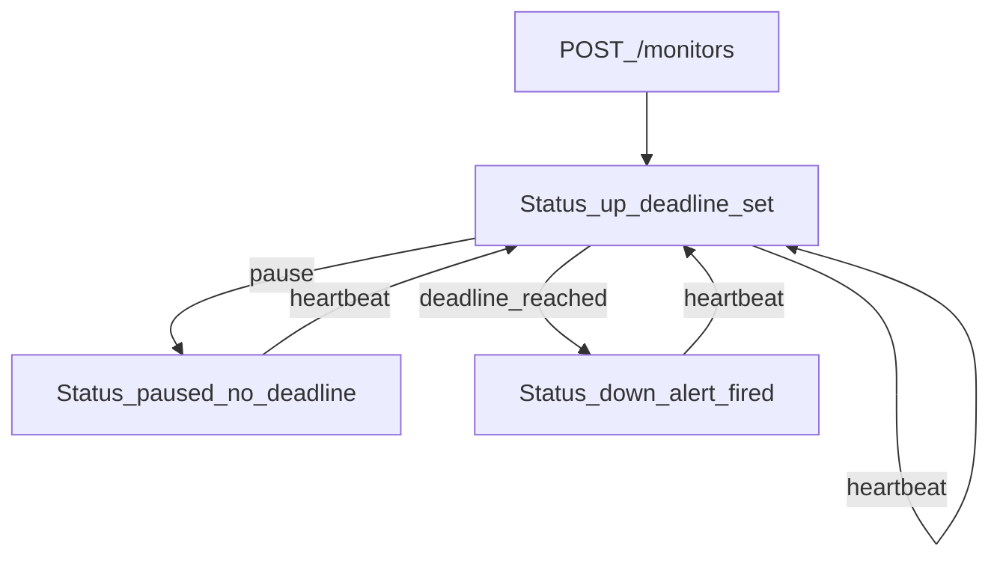

# Pulse-Check-API

FastAPI service implementing a **dead man’s switch**: each monitor has a countdown. If no heartbeat arrives before the deadline, the service marks the device **down** and emits a JSON **alert** log line.

## Architecture

### State flow



### Components

| Piece | Role |
|--------|------|
| `app/main.py` | Routes, lifespan wiring, scheduler task. |
| `app/store.py` | In-memory monitors + `asyncio.Lock` for safe updates. |
| `app/scheduler.py` | Periodic tick; calls store expiry processing. |
| `app/models.py` | Pydantic request/response models. |
| `app/config.py` | Environment-driven scheduler tick interval. |

### Alerts

Timeouts log a single JSON line to the logger `pulse_check.alert` at **INFO**:

```json
{"ALERT":"Device device-123 is down!","time":"<ISO-8601 UTC timestamp>"}
```

## Setup

**Requirements:** Python 3.11+ (3.10+ should work).

```bash
cd backend/Pulse-Check
python -m venv .venv
# Windows:
.venv\Scripts\activate
pip install -r requirements.txt
```

### Run the server

```bash
python -m uvicorn app.main:app --host 0.0.0.0 --port 8001
```

Health: `GET http://localhost:8001/health`

Docs: `http://localhost:8001/docs`

### Run tests

```bash
python -m pytest tests/ -v
```

## API

### `POST /monitors`

Create a monitor and start its countdown.

**Body**

```json
{"id":"device-123","timeout":60,"alert_email":"admin@critmon.com"}
```

**Responses**

- `201 Created` — `{ "message": "..." }`
- `409 Conflict` — duplicate `id`

### `POST /monitors/{id}/heartbeat`

Reset the countdown to `timeout` seconds from now.

- `200 OK` — `{ "message": "Heartbeat received; timer reset." }`
- `404 Not Found` — unknown id

**Note:** If a monitor is `paused` or `down`, a heartbeat **resumes** monitoring (`up`) and sets a fresh deadline.

### `POST /monitors/{id}/pause` (bonus)

Pause monitoring: timer stops; **no** timeout alert fires while paused.

- `200 OK`
- `404 Not Found`

The next heartbeat **unpauses** and restarts the timer.

### `GET /monitors` (developer’s choice)

List monitors. Optional query: `?status=up|down|paused`.

### `GET /monitors/{id}` (developer’s choice)

Return monitor details including approximate `seconds_remaining` when `status` is `up`.

## Configuration

| Variable | Default | Description |
|-----------|---------|-------------|
| `SCHEDULER_TICK_SECONDS` | `1.0` | How often the background loop checks deadlines. |

## Design decisions

1. **Single scheduler loop** — avoids one asyncio task per monitor; acceptable O(n) scan for demo scale.
2. **Central lock** — prevents races between HTTP handlers and the scheduler.
3. **Heartbeat revives `down`** — makes the API usable for recovery drills; documented above.

## Developer’s choice: observability endpoints

Real monitoring stacks expose read APIs for operators. `GET /monitors` and `GET /monitors/{id}` make local debugging and demos much easier than tailing logs alone.
